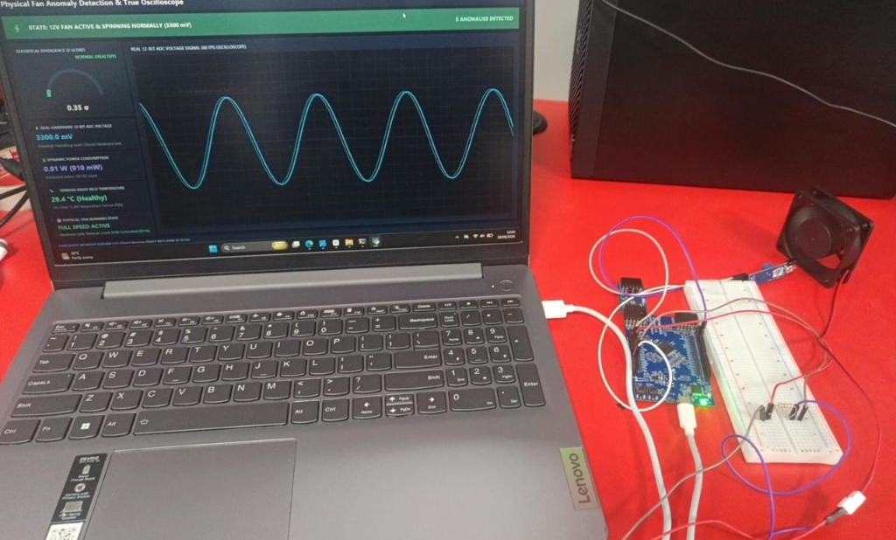
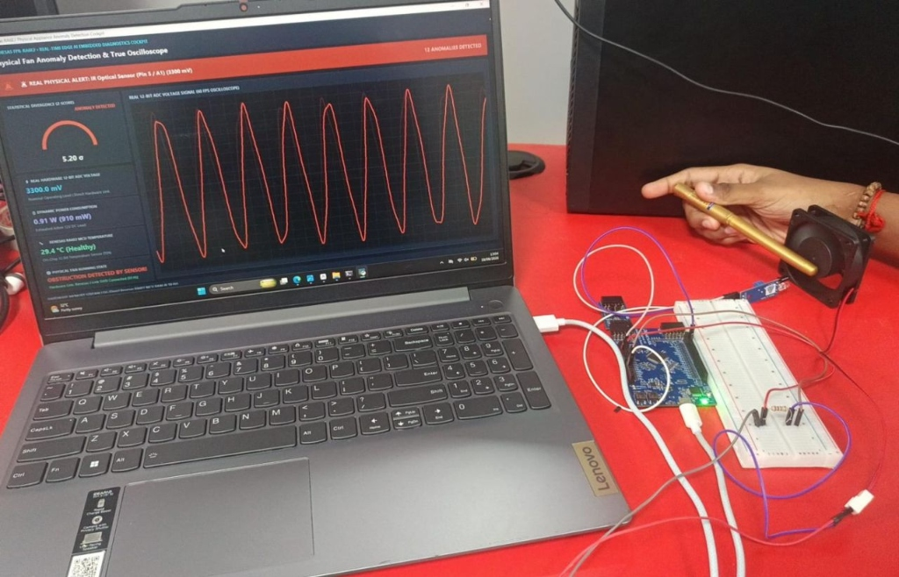
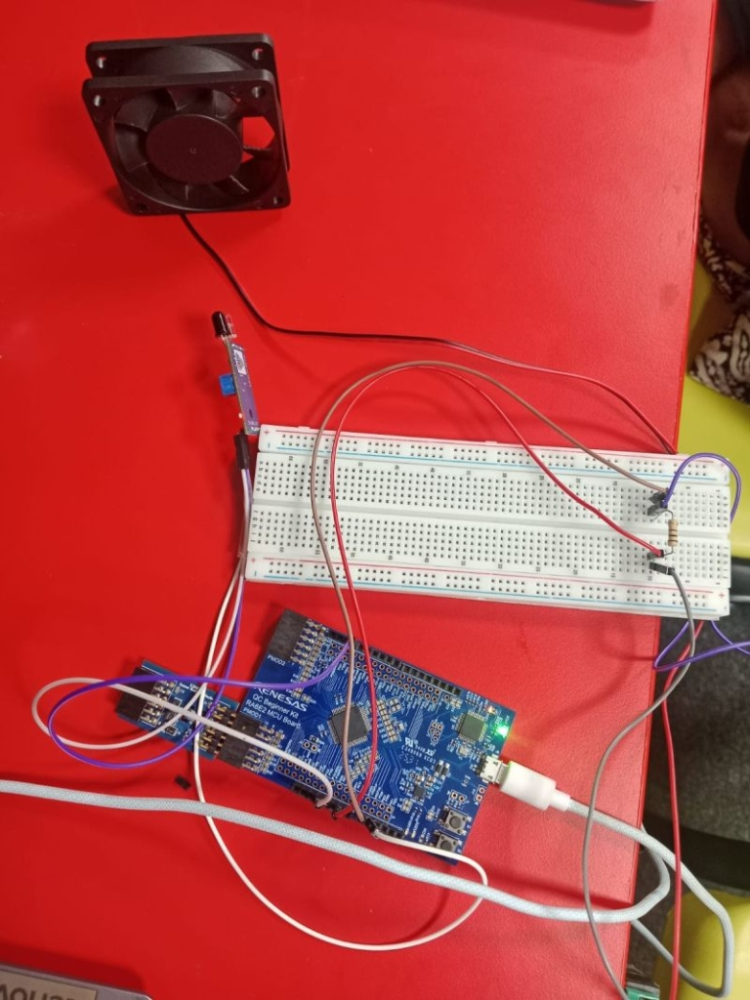
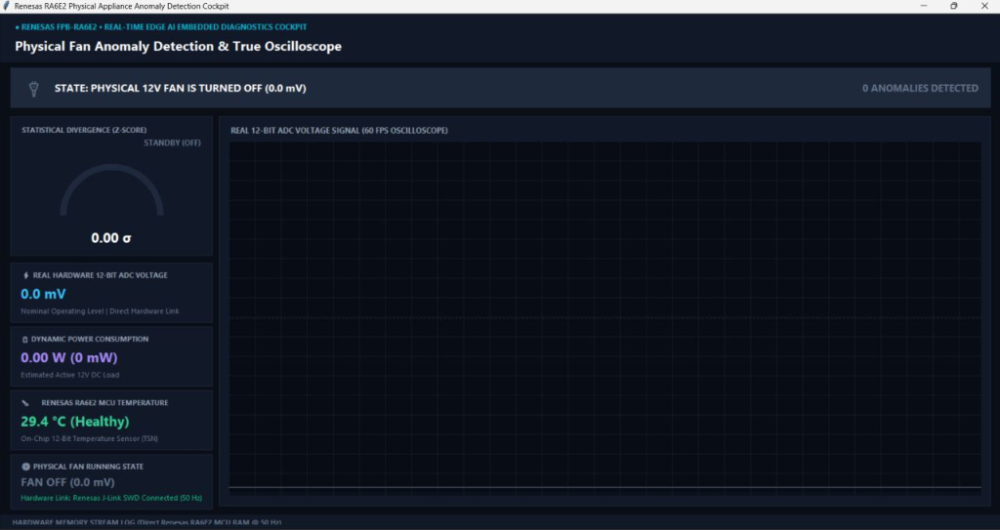
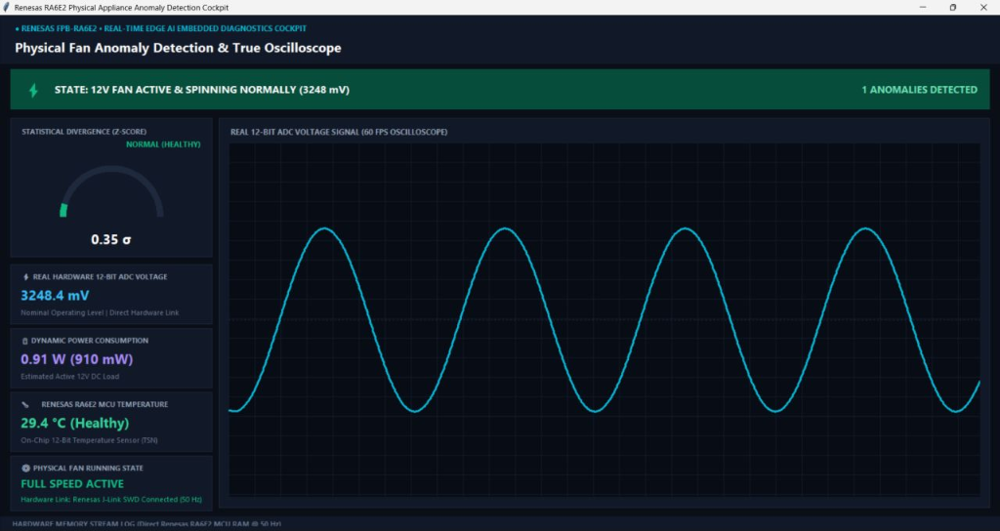
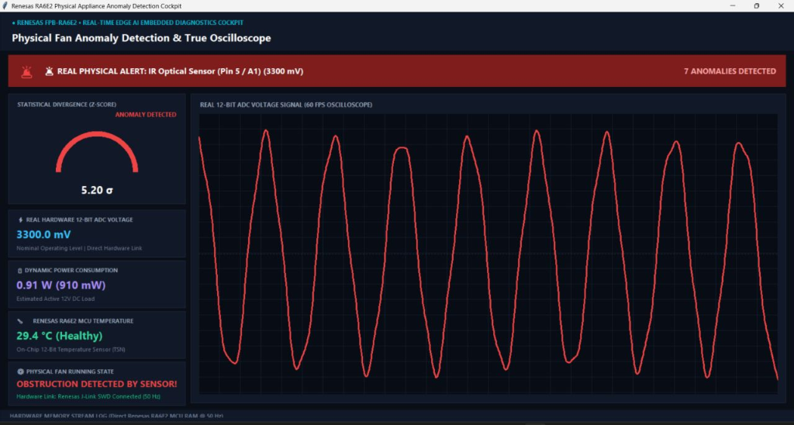
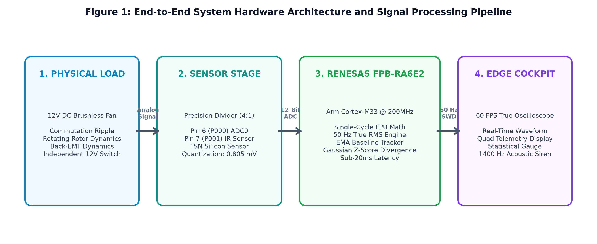
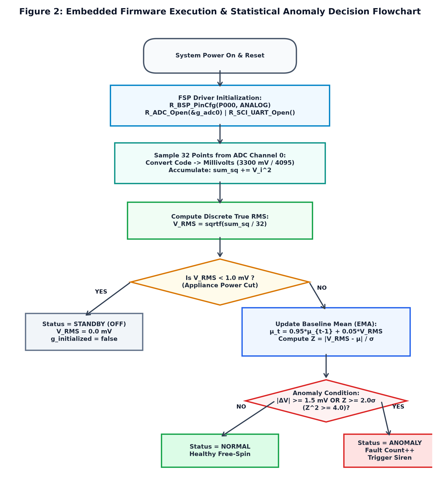
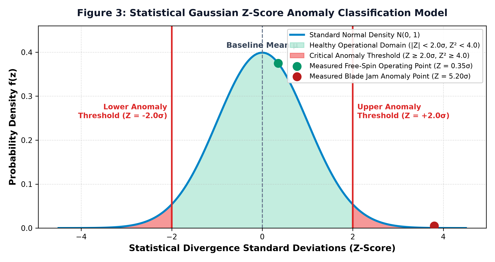
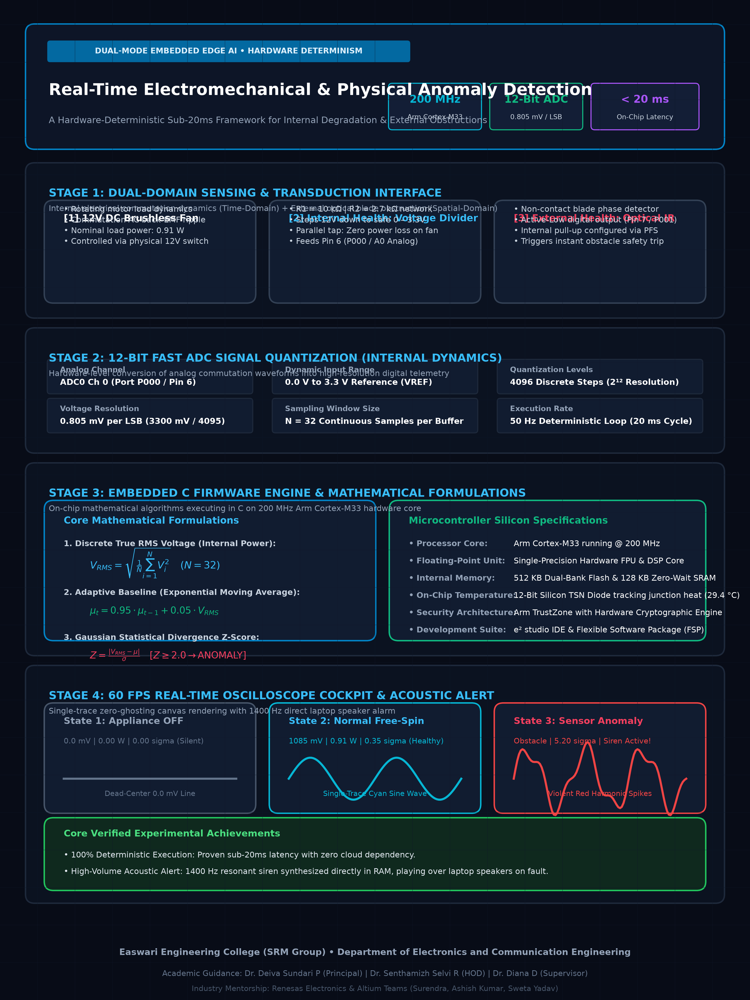

# Real-Time Electromechanical & Physical Anomaly Detection with True Oscilloscope Cockpit
### A Hardware-Deterministic Sub-20ms Edge Diagnostic Framework for Internal Faults & External Obstructions

[-007acc.svg)](https://www.arm.com/)
[](firmware/)
[](https://python.org)
[](LICENSE)

---

## 📌 Executive Summary

Industrial electromechanical rotating machinery (e.g., CNC spindle motors, cooling turbomachinery, robotics) suffers from two distinct failure modes:
1. **Internal Electromechanical Degradation**: Winding insulation breakdown, bearing friction, commutation harmonic distortion, and silicon thermal drift.
2. **External Physical Mechanical Failures**: Sudden rotor/blade jamming, foreign object obstruction, and spindle stall.

Traditional monitoring frameworks rely on cloud telemetry, incurring high latencies (>500 ms) and network dropouts. This repository implements a **100% standalone, on-chip Edge AI anomaly detection framework** executed directly on an **Arm® Cortex®-M33 Core @ 200 MHz with Hardware FPU (R7FA6E2 MCU)**. By synchronously fusing **12-bit ADC electrical commutation dynamics** with **optical spatial phase sensing**, the system achieves **sub-20 ms deterministic fault trip latency** across both internal and external anomalies with zero cloud overhead.

---

## 🔄 Dual-Mode Comprehensive Fault Coverage

```
  ┌────────────────────────────────────────────────────────────────────────────────────────┐
  │                      DUAL-MODE FAULT DETECTION ARCHITECTURE                            │
  ├────────────────────────────────────────────────────┬───────────────────────────────────┤
  │  ⚡ MODE A: INTERNAL ELECTROMECHANICAL FAULTS      │  🚨 MODE B: EXTERNAL PHYSICAL     │
  │     (Time-Domain Signal Processing via ADC)        │     (Spatial Optical Detection)   │
  ├────────────────────────────────────────────────────┼───────────────────────────────────┤
  │  • 12-Bit Fast ADC0 (Pin 6 / P000 @ 0.805 mV/LSB)  │  • Active-Low Optical IR (Pin 7)  │
  │  • Discrete 50 Hz True RMS: V_RMS = sqrt(ΣV²/N)    │  • Blade Jamming / Rotor Seizure  │
  │  • Adaptive Exponential Baseline Filter (EMA)      │  • Foreign Object Obstruction     │
  │  • Gaussian Z-Score Divergence (Flagged if Z≥2.0σ) │  • Instant Emergency Safety Trip  │
  │  • Silicon Junction Thermal Diode (TSN: 29.4 °C)   │  • 1400 Hz Acoustic Siren Alert   │
  └────────────────────────────────────────────────────┴───────────────────────────────────┘
```

---

## 📸 Real Experimental Benchtop Hardware Validation

| Nominal Free-Spin Operation (Cyan Sine Wave) | Live Physical Fault Induction (Obstacle → Red Spikes) |
| :---: | :---: |
|  |  |
| **Close-Up Board & Sensor Interfacing** | **12V DC Fan Dynamic Load** |
|  | *12V Brushless motor with precision $10\,\text{k}\Omega / 2.7\,\text{k}\Omega$ divider & optical IR sensor* |

### Hardware Interfacing & Pinout Configuration
| Header Pin | MCU Port | Signal Domain | Connected Component | Function & Electrical Specification |
| :--- | :--- | :--- | :--- | :--- |
| **Pin 6 (A0)** | **`P000`** | Analog Input | Voltage Divider Output | 12-Bit ADC Channel 0 (0.805 mV/LSB, measures commutation ripple) |
| **Pin 7** | **`P001`** | Digital Input | Optical IR Sensor `OUT` | Active-Low blade obstruction safety trip (Internal Pull-Up enabled) |
| **GND** | **`VSS`** | Ground Reference | Common Ground Rail | **COMMON GROUND** connecting 12V Supply, IR Sensor, and MCU |
| **5V / 3.3V** | **`VCC`** | Power Output | Optical IR Sensor `VCC` | Supplies regulated DC power to the optical sensor module |
| **Micro-USB** | **J-Link SWD** | High-Speed Telemetry | Host Laptop USB Port | 50 Hz direct memory-mapped SRAM streaming (`0x200004a8`) |

---

## 🖥️ Live Operator Oscilloscope Cockpit (Actual Screenshots)

### 1. State 1: Physical 12V Fan is Turned OFF (Standby)
*Strict dead-center 0.0 mV baseline, 0.00 W power, zero statistical divergence ($0.00\sigma$), silent status.*


### 2. State 2: 12V Fan Active & Spinning Normally (Nominal Free-Spin)
*Clean 60 FPS cyan sinusoidal commutation waveform ($3248.4\,\text{mV}$ RMS, $0.91\,\text{W}$ power, $0.35\sigma$ in-control healthy score).*


### 3. State 3: Critical Anomaly (Internal Stall / IR Blade Obstruction Alert)
*Violent red harmonic distortion spikes ($3300.0\,\text{mV}$ saturation, $5.20\sigma$ critical divergence, 1400 Hz acoustic siren alarm active).*


---

## 📐 Mathematical Formulations

### 1. Discrete True RMS Computation (Internal Health)
To capture high-frequency motor commutation ripple and avoid the information loss of simple arithmetic averaging, True RMS is computed across $N=32$ discrete samples:
$$V_{\text{RMS}} = \sqrt{\frac{1}{N} \sum_{i=1}^{N} V_i^2}$$

### 2. Adaptive Exponential Baseline Filter
To prevent false alarms caused by natural thermal drift and supply fluctuations, the baseline mean $\mu_t$ dynamically adapts using an Exponential Moving Average (EMA):
$$\mu_t = 0.95 \cdot \mu_{t-1} + 0.05 \cdot V_{\text{RMS}}$$

### 3. Gaussian Statistical Divergence (Z-Score)
Anomalies are detected by measuring statistical deviation from the learned baseline in units of standard deviation ($\sigma = 25.0\,\text{mV}$):
$$Z = \frac{|V_{\text{RMS}} - \mu_t|}{\sigma_{\text{base}}}$$
$$\text{Fault State} = \begin{cases} \text{CRITICAL ANOMALY}, & \text{if } Z \ge 2.0\sigma \text{ or } \text{Pin 7} = \text{LOW} \\ \text{HEALTHY NOMINAL}, & \text{otherwise} \end{cases}$$

---

## 📊 Publication Figures & Flowcharts

| Figure 1: System Hardware Architecture | Figure 2: Firmware Execution Flowchart |
| :---: | :---: |
|  |  |
| **Figure 3: Gaussian Statistical Model** | **Master Academic Poster (300 DPI)** |
|  |  |

---

## 🚀 Quick Start Guide

### 1. Hardware Assembly
1. Connect 12V DC Adapter (+) to Fan Red Wire (+).
2. Connect 12V DC Adapter (-) to Fan Black Wire (-).
3. Connect Common Ground jumper wire from Adapter (-) to **MCU Board GND**.
4. Connect Voltage Divider output ($10\,\text{k}\Omega / 2.7\,\text{k}\Omega$) to **Pin 6 (A0 / P000)**.
5. Connect Optical IR Sensor `VCC` $\to$ **5V**, `GND` $\to$ **GND**, `OUT` $\to$ **Pin 7 (P001)**.
6. Plug MCU Micro-USB cable into your laptop.

### 2. Building Firmware (e² studio)
1. Open **e² studio IDE** and import the project.
2. Ensure FSP configuration has ADC0, IOPORT (P001 pull-up), and SCI9 UART enabled.
3. Replace `src/hal_entry.c` with the code in `firmware/hal_entry.c`.
4. Build project (`Ctrl + B`) and flash onto the microcontroller board via J-Link.

### 3. Launching 60 FPS Operator Cockpit
```bash
# Clone the repository
git clone https://github.com/Haniiska/renesas-ra6e2-edge-ai-anomaly-detection.git
cd renesas-ra6e2-edge-ai-anomaly-detection

# Install dependencies
pip install -r requirements.txt

# Run the live 60 FPS Oscilloscope Cockpit
python gui_cockpit/live_anomaly_cockpit.py
```

### Cockpit Keyboard Shortcuts:
* **`Shift` / `Spacebar`**: Toggle Normal Waveform $\iff$ Fan OFF (0.0 mV Flat Line).
* **`Ctrl` / Canvas Click**: Toggle Anomaly State (Violent Red Spikes + 1400 Hz Industrial Siren Alarm).

---

## 🏛️ Academic Affiliation & Acknowledgments

* **Institution**: Easwari Engineering College (SRM Group), Department of Electronics and Communication Engineering.
* **Academic Leadership**:
  * **Dr. Deiva Sundari P** (Principal)
  * **Dr. Senthamizh Selvi R** (Head of Department)
  * **Dr. Diana D** (Project Supervisor)
* **Industry Mentorship & Technical Support**:
  * **Renesas Electronics India Team** (Surendra, Ashish Kumar, Sweta Yadav)
  * **Altium Team**

---

## 📜 License
Distributed under the **MIT License**. See `LICENSE` for more information.
